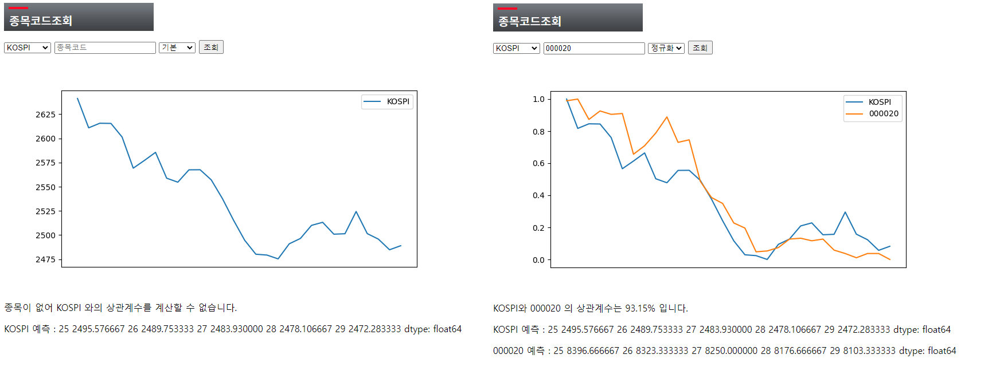

# Contributor
- [Springfield_M1A](https://github.com/Springfield-M1A)
- [Taeho24](https://github.com/Taeho24)
---
# Project
- Market Stock Data Analysis, Visualization, Prediction Web Service
---
# Install
1. After Cloning this repository, move to the directory and open the terminal or command prompt.
2. By using terminal or command prompt, create virtual environment and activate it.
    ```
    Windows :
    1. python -m venv venv
    2. venv\Scripts\activate
    ```
    ```
    macOS / Linux :
    1. python3 -m venv venv
    2. source venv/bin/activate
    ```
3. Install required libraries by using requirements.txt
    ```
    pip install -r requirements.txt
    ```
4. Migrate and runserver using manage.py
    ```
    python manage.py migrate
    python manage.py runserver
    ```
---
# Dependencies
## Development Environment
- [PyCharm](https://www.jetbrains.com/ko-kr/pycharm/)
- [Windows 11](https://www.microsoft.com/ko-kr/windows/windows-11)
- [macOS Ventura](https://www.apple.com/kr/macos/monterey-preview/)
## Language, Framework, Library
- [Django](https://www.djangoproject.com/)
- [Python](https://www.python.org/)
- [HTML](https://developer.mozilla.org/ko/docs/Web/HTML)
- Other Libraries are listed in requirements.txt
---
# How to use

1. KOSPI / KOSDAQ Info and Graph will be shown
2. If you put stock code in it, you can see the stock info and graph with it
3. Normalization is also provided
4. with NumPy's corr coefficient function, you can see the correlation between two stocks
5. Also, with model ARIMA, the prediction of the stock price is provided
---
# License
```
Copyright (c) 2019-present NAVER Corp.

Permission is hereby granted, free of charge, to any person obtaining a copy
of this software and associated documentation files (the "Software"), to deal
in the Software without restriction, including without limitation the rights
to use, copy, modify, merge, publish, distribute, sublicense, and/or sell
copies of the Software, and to permit persons to whom the Software is
furnished to do so, subject to the following conditions:

The above copyright notice and this permission notice shall be included in
all copies or substantial portions of the Software.

THE SOFTWARE IS PROVIDED "AS IS", WITHOUT WARRANTY OF ANY KIND, EXPRESS OR
IMPLIED, INCLUDING BUT NOT LIMITED TO THE WARRANTIES OF MERCHANTABILITY,
FITNESS FOR A PARTICULAR PURPOSE AND NONINFRINGEMENT.  IN NO EVENT SHALL THE
AUTHORS OR COPYRIGHT HOLDERS BE LIABLE FOR ANY CLAIM, DAMAGES OR OTHER
LIABILITY, WHETHER IN AN ACTION OF CONTRACT, TORT OR OTHERWISE, ARISING FROM,
OUT OF OR IN CONNECTION WITH THE SOFTWARE OR THE USE OR OTHER DEALINGS IN
THE SOFTWARE.
```
```angular2html
Select market data provided by ICE Data Services
© 2023 TradingView, Inc.
```
```angular2html
COPYRIGHT© DAOL Investment & Securities Co., Ltd. ALL RIGHTS RESERVED
```
---
# Contact
[springfieldm1a@ruu.kr](springfieldm1a@ruu.kr)
